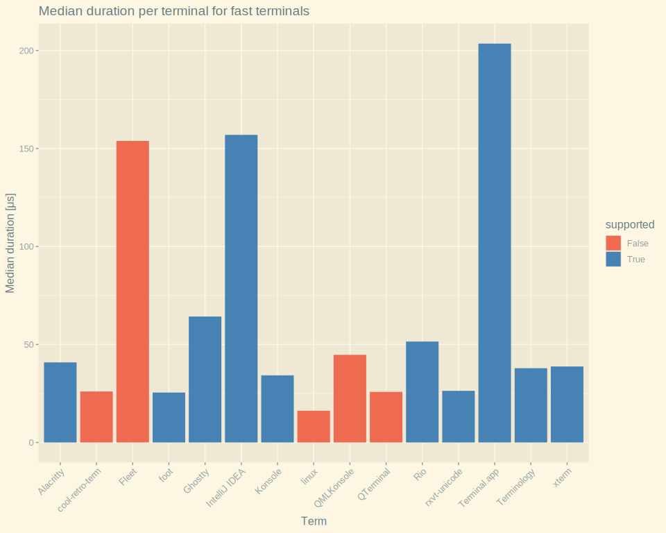

# Latency Measurements
Measurements generated using [examples/benchmark](../examples/benchmark/src/main.rs):
```shell
cargo run --release -p benchmark '<TERM_NAME>'
```

## Fast Terminals
<picture>
    <source srcset="../benchmark/measurements_fast_dark.svg" media="(prefers-color-scheme: dark)">
    
</picture>

## Slow Terminals
<picture>
    <source srcset="../benchmark/measurements_slow_dark.svg" media="(prefers-color-scheme: dark)">
    
</picture>

**ℹ️ Note:**
The macOS terminals were not tested on the same machine as the Linux terminals.
